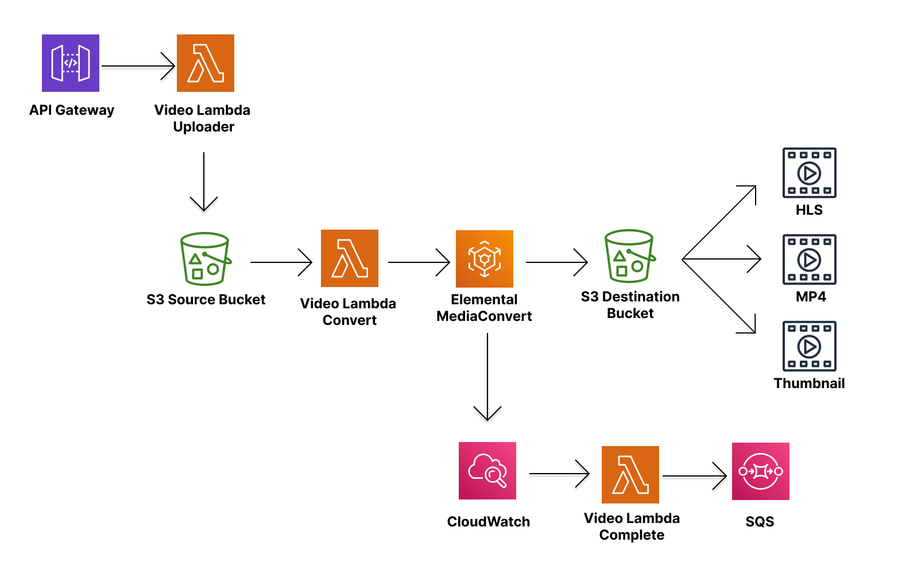

# FitQA-AWS-Video



## Structure
`FitQA-AWS-Video`는 다음과 같은 구조를 가지고 있습니다.
- 비디오를 업로드 하는 `fitqa-video-uploader`.
- 업로드된 비디오를 인코딩하는 `fitqa-video-lambda-convert`.
- 인코딩이 완료되면 메시징을 만들어주는 `fitqa-video-lambda-complete`

***

## Implement
### fitqa-video-lambda-uploader
- Request form-data로 `video`에 파일을 넣어서 전달해주면 `s3 source bucket`에 저장한다.
- 주소는 `API Gateway`에서 설정한다.

### fitqa-video-lambda-convert
- [상세내용](./fitqa-video-lambda-convert/README.md)


### fitqa-video-lambda-complete
- 메시지는 클라이언트에서 사용 후 삭제해야함
- 아래는 인코딩이 성공했을때의 메시지 내용입니다.
```json
{
    "status": "SUCCESS",
    "time": "2022-05-09T14:33:26Z",
    "key": "ejl8vkW7V60XYgFK0ljm",
    "files": [
        {
            "type": "video",
            "url": "https://fitqa-video-dest.s3.ap-northeast-2.amazonaws.com/ejl8vkW7V60XYgFK0ljm/Default/MP4/ejl8vkW7V60XYgFK0ljm.mp4",
            "width": 1280,
            "height": 720
        },
        {
            "type": "image",
            "url": "https://fitqa-video-dest.s3.ap-northeast-2.amazonaws.com/ejl8vkW7V60XYgFK0ljm/Default/Thumbnails/ejl8vkW7V60XYgFK0ljm.0000001.jpg",
            "width": 1280,
            "height": 720
        }
    ]
}
```

***

## TODO
- [x] 동영상 인코딩
- [x] `AWS-API-GATEWAY`에 연결
- [x] 인코딩이 완료됨을 알려주는 메시징큐 연결
- [ ] 환경에 맞는 인코딩으로 설정 변경