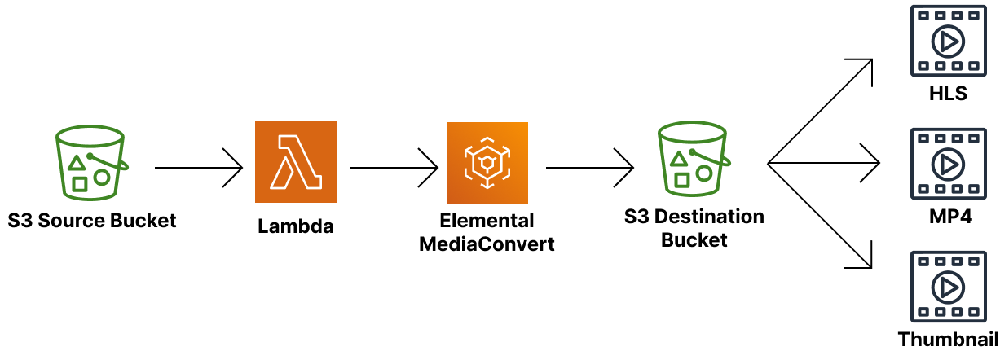

# FitQA-Video-Lambda-Converter

## Structure
`FitQA-Video-Convert`는 다음과 같은 구조를 가지고 있습니다.
- 입력 비디오를 저장하는 `s3` 저장소.
- 입력 비디오를 `Media Convert`로 전달해주는 `Lambda`.
- 비디오를 인코딩하는 `Elemental MediaConvert`.
- 인코딩된 비디오를 저장하는 `s3` 저장소.

***

## Implement
### s3 Source Bucket
- 이름을 `fitqa-video-source`로 만듬

### Lambda
- 이름은 `fitqa-video-lambda-convert`로 만듬
- `fitqa-video-source`에 파일이 `PUT` 되면 실행되는 트리거를 가짐
- `job.json`에 설정된 인코딩 방식으로 `MediaConvert`에 작업을 넘김

### Elemental MediaConvert
- `Lambda`에서 넘어온 그대로 수행해서 `fitqa-vide-dest`에 결과물 저장

### s3 Destination Bucket
- 이름을 `fitqa-video-dest`로 만듬
- `<파일명>/Default` 경로 안에 `HLS`, `MP4`, `Thumbnail` 폴더가 각각 만들어짐

***

## TODO
- [x] 동영상 인코딩
- [ ] 환경에 맞는 인코딩으로 설정 변경